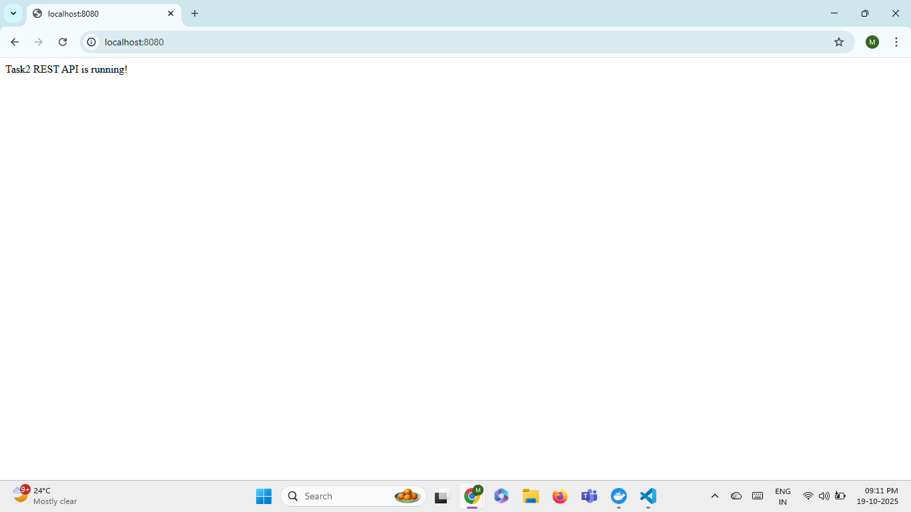
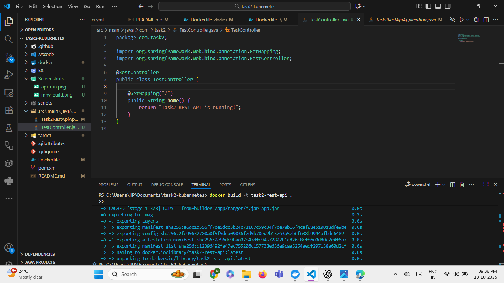
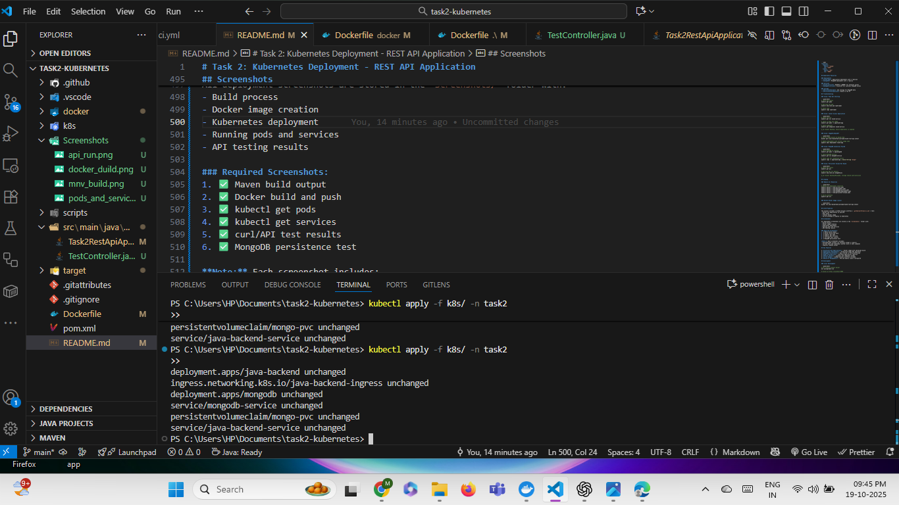
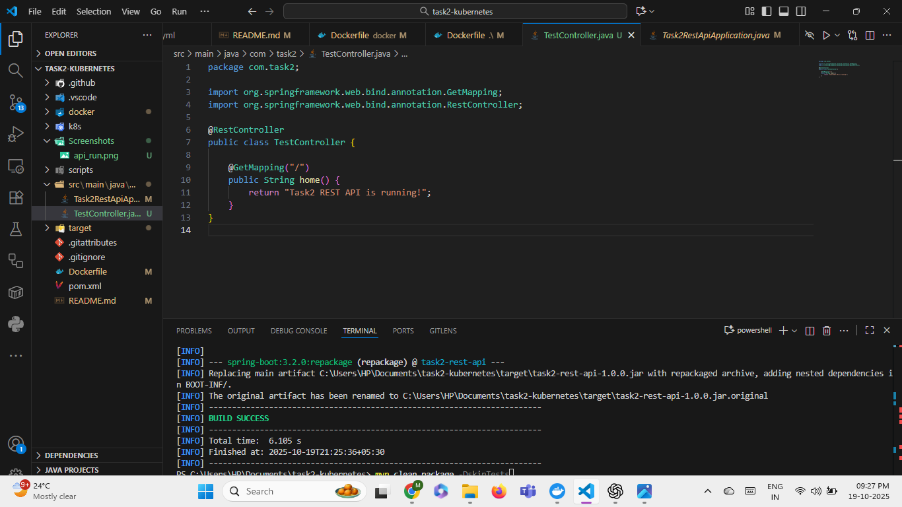
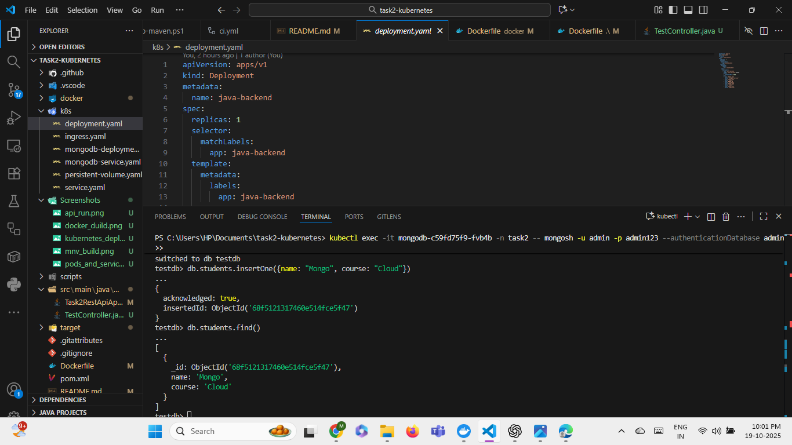
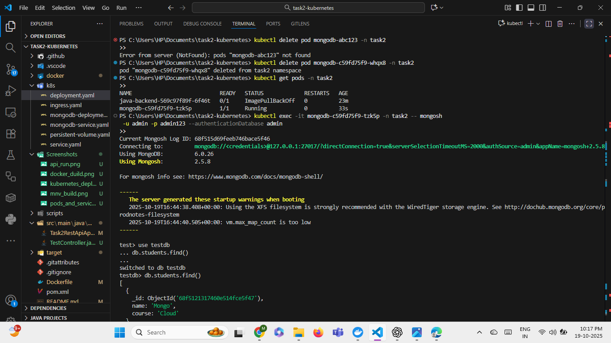
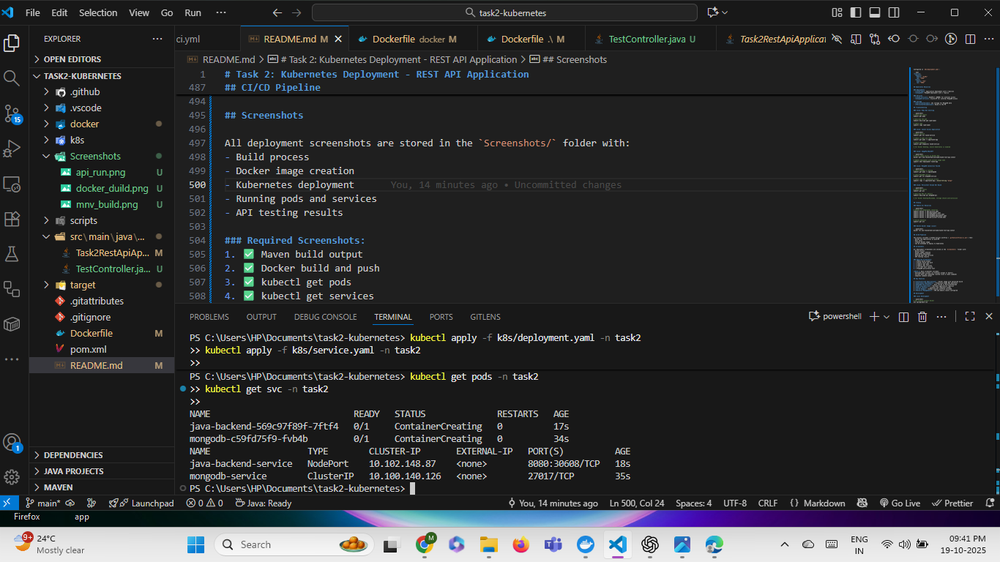

# Task 2: Kubernetes Deployment - REST API Application

This project demonstrates containerization and Kubernetes deployment of a Java REST API application with MongoDB persistence.

## Project Structure

```
task2-kubernetes/
│
├── .github/
│   └── workflows/
│       └── ci.yml                    # CI/CD pipeline configuration
│
├── docker/
│   └── Dockerfile                    # Docker containerization
│
├── k8s/
│   ├── deployment.yaml               # Application deployment
│   ├── service.yaml                  # Application service (NodePort)
│   ├── mongodb-deployment.yaml       # MongoDB deployment
│   ├── mongodb-service.yaml          # MongoDB service
│   ├── persistent-volume.yaml        # PersistentVolume and PVC
│   └── ingress.yaml                  # Ingress configuration (optional)
│
├── scripts/
│   ├── setup-maven.ps1               # Maven setup script
│   └── strip-bom.ps1                 # BOM removal utility
│
├── src/
│   └── main/
│       └── java/
│           └── com/task2/
│               ├── Task2RestApiApplication.java  # Spring Boot main class
│               └── TestController.java           # REST API controller
│
├── Screenshots/
│   └── api_run.png                   # Application screenshots
│
├── Dockerfile                         # Docker build configuration
├── pom.xml                           # Maven dependencies
├── README.md                         # This file
└── .gitignore                        # Git ignore rules
```

## Prerequisites

- **Java 17** or higher
- **Maven 3.6+**
- **Docker** Desktop or Docker Engine
- **Kubernetes** cluster (Docker Desktop, Minikube, or Kind)
- **kubectl** CLI tool
- **Docker Hub** account (for pushing images)

## Technology Stack

- **Java 17** - Programming language
- **Spring Boot 3.x** - Application framework
- **Maven** - Build tool
- **Docker** - Containerization
- **Kubernetes** - Orchestration platform
- **MongoDB** - Database (deployed in K8s)

## Quick Start

### 1. Build the Application

```powershell
# Build with Maven
mvn clean package -DskipTests

# Or use the setup script
.\scripts\setup-maven.ps1
```

### 2. Build Docker Image

```powershell
# Build the Docker image
docker build -t your-dockerhub-username/task2-rest-api:latest -f docker/Dockerfile .

# Or use the root Dockerfile
docker build -t your-dockerhub-username/task2-rest-api:latest .
```

### 3. Push to Docker Hub

```powershell
# Login to Docker Hub
docker login

# Push the image
docker push your-dockerhub-username/task2-rest-api:latest
```

### 4. Update Kubernetes Manifests

Edit `k8s/deployment.yaml` and update the image name:

```yaml
spec:
  containers:
  - name: task2-app
    image: your-dockerhub-username/task2-rest-api:latest
```

### 5. Deploy to Kubernetes

```powershell
# Apply Kubernetes manifests in order

# 1. Create persistent volume for MongoDB
kubectl apply -f k8s/persistent-volume.yaml

# 2. Deploy MongoDB
kubectl apply -f k8s/mongodb-deployment.yaml
kubectl apply -f k8s/mongodb-service.yaml

# 3. Wait for MongoDB to be ready
kubectl wait --for=condition=ready pod -l app=mongodb --timeout=120s

# 4. Deploy the application
kubectl apply -f k8s/deployment.yaml
kubectl apply -f k8s/service.yaml

# 5. Wait for application to be ready
kubectl wait --for=condition=ready pod -l app=task2-app --timeout=120s
```

### 6. Verify Deployment

```powershell
# Check all resources
kubectl get all

# Check pods
kubectl get pods

# Check services
kubectl get svc

# Check persistent volumes
kubectl get pv,pvc
```

Expected output:
```
NAME                           READY   STATUS    RESTARTS   AGE
pod/mongodb-xxx-xxx            1/1     Running   0          2m
pod/task2-app-xxx-xxx          1/1     Running   0          1m

NAME                     TYPE        CLUSTER-IP      EXTERNAL-IP   PORT(S)          AGE
service/mongodb-service  ClusterIP   10.96.xxx.xxx   <none>        27017/TCP        2m
service/task2-service    NodePort    10.96.xxx.xxx   <none>        8080:30080/TCP   1m
```

## Accessing the Application

### Docker Desktop Kubernetes

```powershell
# Access via localhost
$url = "http://localhost:30080"

# Test the API
curl $url/api/test
```

### Minikube

```powershell
# Get the service URL
minikube service task2-service --url

# Or use Minikube IP
$MINIKUBE_IP = minikube ip
curl "http://${MINIKUBE_IP}:30080/api/test"
```

### Kind (Kubernetes in Docker)

```powershell
# Use port forwarding
kubectl port-forward svc/task2-service 8080:8080

# Then access via localhost
curl http://localhost:8080/api/test
```

## API Endpoints

### Health Check
```powershell
# GET /actuator/health
curl http://localhost:30080/actuator/health
```

### Test Endpoint
```powershell
# GET /api/test
curl http://localhost:30080/api/test
```

**Expected Response:**
```json
{
  "message": "Hello from Task 2 Kubernetes!",
  "timestamp": "2025-10-19T..."
}
```

## Testing the Deployment

### Test 1: Verify Pods are Running

```powershell
kubectl get pods

# Expected: All pods in Running status with 1/1 or 2/2 READY
```

### Test 2: Check Application Logs

```powershell
# Get pod name
$POD_NAME = kubectl get pods -l app=task2-app -o jsonpath='{.items[0].metadata.name}'

# View logs
kubectl logs $POD_NAME

# Follow logs
kubectl logs -f $POD_NAME
```

### Test 3: Test API Endpoints

```powershell
# Health check
Invoke-RestMethod -Uri "http://localhost:30080/actuator/health" -Method Get

# Test endpoint
Invoke-RestMethod -Uri "http://localhost:30080/api/test" -Method Get
```

### Test 4: Test MongoDB Persistence

```powershell
# Check MongoDB pod
kubectl get pods -l app=mongodb

# Delete MongoDB pod to test persistence
kubectl delete pod -l app=mongodb

# Wait for new pod to start
Start-Sleep -Seconds 30
kubectl wait --for=condition=ready pod -l app=mongodb --timeout=120s

# Verify data persists (if you had data)
kubectl get pvc
```

### Test 5: Scale the Application

```powershell
# Scale to 3 replicas
kubectl scale deployment task2-app --replicas=3

# Verify scaling
kubectl get pods -l app=task2-app

# Scale back to 2
kubectl scale deployment task2-app --replicas=2
```

## Monitoring and Debugging

### View Application Logs

```powershell
# All application pods
kubectl logs -l app=task2-app --tail=100

# Specific pod
kubectl logs <pod-name>

# Follow logs in real-time
kubectl logs -f <pod-name>
```

### View MongoDB Logs

```powershell
kubectl logs -l app=mongodb --tail=50
```

### Describe Resources

```powershell
# Describe pod
kubectl describe pod <pod-name>

# Describe service
kubectl describe svc task2-service

# Describe deployment
kubectl describe deployment task2-app
```

### Check Events

```powershell
# Recent events
kubectl get events --sort-by='.lastTimestamp' | Select-Object -Last 20
```

### Execute Commands in Pod

```powershell
# Get shell access to application pod
kubectl exec -it <pod-name> -- /bin/sh

# Test MongoDB connection from app pod
kubectl exec -it <pod-name> -- nc -zv mongodb-service 27017
```

## Architecture

```
┌─────────────────────────────────────────────────┐
│            Kubernetes Cluster                    │
│                                                  │
│  ┌──────────────────┐      ┌──────────────┐    │
│  │   Task2 App Pod  │─────▶│ MongoDB Pod  │    │
│  │   (Replica 1)    │      │              │    │
│  └──────────────────┘      │  + PV        │    │
│           │                 └──────────────┘    │
│  ┌──────────────────┐                           │
│  │   Task2 App Pod  │                           │
│  │   (Replica 2)    │                           │
│  └──────────────────┘                           │
│           │                                      │
│           ▼                                      │
│  ┌──────────────────┐                           │
│  │  NodePort Service│                           │
│  │   Port: 30080    │                           │
│  └──────────────────┘                           │
│           │                                      │
└───────────┼──────────────────────────────────────┘
            │
            ▼
      External Access
    (localhost:30080)
```

## Configuration

### Environment Variables

The application uses environment variables for configuration (defined in `k8s/deployment.yaml`):

```yaml
env:
- name: SPRING_DATA_MONGODB_HOST
  value: "mongodb-service"
- name: SPRING_DATA_MONGODB_PORT
  value: "27017"
- name: SPRING_DATA_MONGODB_DATABASE
  value: "task2db"
- name: SERVER_PORT
  value: "8080"
```

### Resource Limits

Configured in `k8s/deployment.yaml`:

```yaml
resources:
  requests:
    memory: "512Mi"
    cpu: "250m"
  limits:
    memory: "1Gi"
    cpu: "500m"
```

## Kubernetes Resources

### Deployments
- **task2-app**: Application deployment with 2 replicas
- **mongodb**: MongoDB deployment with 1 replica

### Services
- **task2-service**: NodePort (30080) for external access
- **mongodb-service**: ClusterIP for internal MongoDB access

### Storage
- **PersistentVolume**: 1Gi storage for MongoDB data
- **PersistentVolumeClaim**: Bound to the PV

## Troubleshooting

### Issue: Pods Not Starting

```powershell
# Check pod status
kubectl get pods

# Describe the pod
kubectl describe pod <pod-name>

# Check logs
kubectl logs <pod-name>
```

### Issue: Cannot Access Application

```powershell
# Check service
kubectl get svc task2-service

# Check if pods are ready
kubectl get pods -l app=task2-app

# Check endpoints
kubectl get endpoints task2-service

# For Docker Desktop, ensure Kubernetes is enabled
```

### Issue: ImagePullBackOff

```powershell
# Verify image exists on Docker Hub
docker pull your-dockerhub-username/task2-rest-api:latest

# Update deployment with correct image name
kubectl edit deployment task2-app
```

### Issue: MongoDB Connection Failed

```powershell
# Check MongoDB is running
kubectl get pods -l app=mongodb

# Check MongoDB service
kubectl get svc mongodb-service

# Check logs for connection errors
kubectl logs -l app=task2-app | Select-String "mongo"
```

### Issue: Persistent Volume Not Bound

```powershell
# Check PVC status
kubectl get pvc

# Describe PVC for details
kubectl describe pvc mongodb-pvc

# For Docker Desktop/Minikube, storage should auto-provision
```

## Cleanup

### Remove All Resources

```powershell
# Delete all Kubernetes resources
kubectl delete -f k8s/service.yaml
kubectl delete -f k8s/deployment.yaml
kubectl delete -f k8s/mongodb-service.yaml
kubectl delete -f k8s/mongodb-deployment.yaml
kubectl delete -f k8s/persistent-volume.yaml

# Verify deletion
kubectl get all
```

### Delete Docker Image (Local)

```powershell
docker rmi your-dockerhub-username/task2-rest-api:latest
```

## CI/CD Pipeline

The project includes a GitHub Actions workflow (`.github/workflows/ci.yml`) that:
- Builds the application on push/PR
- Runs tests
- Creates Docker image
- Can be extended to deploy to Kubernetes

## Screenshots

### API Testing


### Docker Build


### Kubernetes Deployment


### Maven Build


### Mongodb Persistence Test_1


### Mongodb Persistence Test_2


### Pods and Services


All deployment screenshots are stored in the `Screenshots/` folder with:
- Build process
- Docker image creation
- Kubernetes deployment
- Running pods and services
- API testing results


**Note:** Each screenshot includes:
- Username/name visible (in terminal prompt or editor)
- Current date and timestamp (system clock or date command)
- Complete command output

## Key Features

✅ **Containerized Application** - Docker image with optimized build
✅ **Kubernetes Deployment** - Production-ready K8s manifests
✅ **MongoDB Persistence** - Data stored in PersistentVolume
✅ **High Availability** - Multiple application replicas
✅ **Health Checks** - Liveness and readiness probes
✅ **CI/CD Ready** - GitHub Actions workflow included
✅ **Resource Management** - CPU and memory limits configured

## Development

### Local Development

```powershell
# Run locally without Docker
mvn spring-boot:run

# Access at http://localhost:8080
```

### Building JAR

```powershell
mvn clean package

# JAR location: target/task2-rest-api-1.0.0.jar

# Run JAR
java -jar target/task2-rest-api-1.0.0.jar
```

### Testing Changes

```powershell
# Rebuild Docker image
docker build -t your-dockerhub-username/task2-rest-api:latest .

# Push to Docker Hub
docker push your-dockerhub-username/task2-rest-api:latest

# Restart deployment to pull new image
kubectl rollout restart deployment/task2-app
```

## Best Practices Implemented

- ✅ Multi-stage Docker build for smaller images
- ✅ Non-root user in containers
- ✅ Health checks configured
- ✅ Resource limits defined
- ✅ Persistent storage for stateful services
- ✅ Environment-based configuration
- ✅ Proper labeling and selectors
- ✅ Service separation (app and database)

## Important Notes

1. **Image Name**: Always update the image name in `k8s/deployment.yaml` to match your Docker Hub username
2. **Port**: Application exposed on NodePort 30080
3. **Data Persistence**: MongoDB data survives pod restarts due to PersistentVolume
4. **Scaling**: Application can be scaled horizontally using `kubectl scale`

## Support and Documentation

- **Kubernetes Docs**: https://kubernetes.io/docs/
- **Spring Boot Docs**: https://spring.io/projects/spring-boot
- **Docker Docs**: https://docs.docker.com/

## Author

**[Vishnu]**

Created for Kaiburr LLC Assessment 2025

## License

This project is created for educational and assessment purposes.

---

**Status**: ✅ Deployment Ready | 🚀 Production Grade | 📦 Containerized